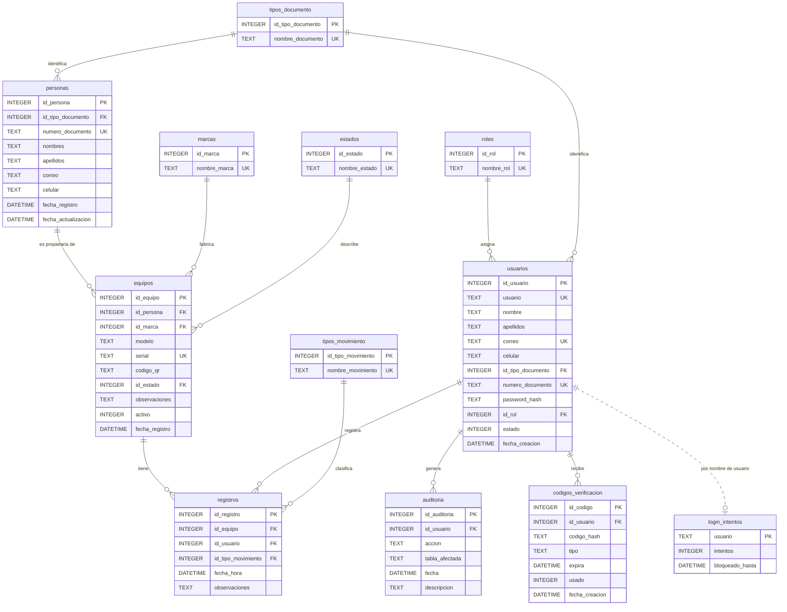

# Diagrama Entidad-Relación — CheckIT v6

Generado a partir de `backend/db/schema.sql`. GitHub y VS Code (con la
extensión de Mermaid) lo muestran como diagrama; para exportarlo a PNG se
puede pegar en <https://mermaid.live>.

`login_intentos` no tiene llave foránea a `usuarios` a propósito: registra
también intentos con nombres de usuario que no existen, para que el bloqueo
no revele qué cuentas son reales.
